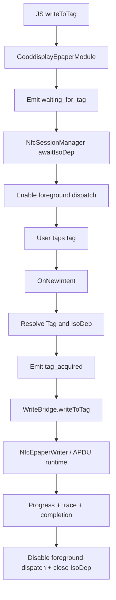

# Checkpoint 5 Status: Native NFC Ownership

**Status:** Implemented (Android codepath refactored)  
**Module:** `modules/gooddisplay-epaper`  
**Depends on:** Checkpoints 1–4

---

## Architecture decisions

Checkpoint 5 replaces the previous hybrid NFC handoff with full native ownership inside the Expo module.

New runtime flow:

```
JS writeToTag(options)
  ↓
GooddisplayEpaperModule.writeToTag
  ↓ (emit onStatus: waiting_for_tag)
NfcSessionManager.awaitIsoDep(activity)
  ↓
Foreground dispatch enabled
  ↓
OnNewIntent receives Tag
  ↓
IsoDep.get(tag) + connect
  ↓
WriteBridge.writeToTag(context, isoDep, options, callbacks)
  ↓
WriteSession + NfcEpaperWriter + APDU runtime
  ↓
onProgress/onTrace/onComplete(onError)
  ↓
cleanup foreground dispatch + IsoDep close
```

Key design choices:

- NFC discovery was moved entirely into native (`NfcSessionManager`) with no react-native-nfc-manager dependency in runtime path.
- `GooddisplayEpaperModule` now owns lifecycle hooks (`OnNewIntent`, activity foreground/background), cancellation fan-out, and status events for wait/acquire transitions.
- `WriteBridge` is now orchestration-only for image + protocol write and receives an already-acquired `IsoDep`.

---

## Ownership changes

| Layer | Before (CP4) | After (CP5) |
|------|------|------|
| Tag discovery | RN (`react-native-nfc-manager`) | Native module (`NfcSessionManager`) |
| Foreground dispatch | Not owned by module | Owned by module |
| NFC intent handling | RN + reflection handoff | Expo module `OnNewIntent` |
| IsoDep acquisition | Reflection bridge | Native `Tag` → `IsoDep.get(tag)` |
| Write bridge | Mixed NFC + write orchestration | Pure write orchestration |

---

## Deleted legacy bridge pieces

Removed from Android runtime:

- `bridge/NfcManagerBridge.kt`
- `bridge/NfcHandoffStore.kt`
- `registerNfcHandoff()` native API
- `NfcHandoffOptions` / `NfcHandoffResult` TypeScript types
- `tagIdHex` from `WriteToTagOptions`

Also removed stubbed `registerNfcHandoff` entries from iOS/web module surfaces so public API matches native ownership model.

---

## Runtime flow diagram



---

## Lifecycle handling

### Foreground dispatch enable/disable

- Enabled when `awaitIsoDep(activity)` begins waiting.
- Re-enabled on `OnActivityEntersForeground` if a wait is still active.
- Disabled on successful tag acquisition, cancellation, activity backgrounding, and final cleanup path.

### Intent handling

- `OnNewIntent` forwards incoming intents to `NfcSessionManager`.
- Manager accepts NFC actions (`ACTION_TAG_DISCOVERED`, `ACTION_TECH_DISCOVERED`, `ACTION_NDEF_DISCOVERED`), extracts `Tag`, validates `IsoDep` tech, then connects `IsoDep`.

### Cancellation behavior

- `cancelWrite()` now fans out to both wait and write layers:
  - `NfcSessionManager.cancel()` for pre-write wait cancellation
  - `WriteBridge.cancelWrite()` for in-flight APDU cancellation
- If app backgrounds while waiting for tag, wait is cancelled intentionally to avoid stale dispatch ownership.

### Resource cleanup

- `GooddisplayEpaperModule.writeToTag` `finally` always triggers:
  - `nfcSessionManager.cleanup(activity)`
  - `IsoDep.close()` best-effort

---

## Files changed

- Added: `android/src/main/java/expo/modules/gooddisplayepaper/nfc/NfcSessionManager.kt`
- Added: `android/src/main/java/expo/modules/gooddisplayepaper/bridge/WriteBridgeCallbacks.kt`
- Updated: `android/src/main/java/expo/modules/gooddisplayepaper/GooddisplayEpaperModule.kt`
- Updated: `android/src/main/java/expo/modules/gooddisplayepaper/bridge/WriteBridge.kt`
- Updated: `android/src/main/AndroidManifest.xml`
- Updated: `src/GooddisplayEpaper.types.ts`
- Updated: `src/GooddisplayEpaperModule.ts`
- Updated: `src/GooddisplayEpaperModule.web.ts`
- Updated: `ios/GooddisplayEpaperModule.swift`
- Deleted: `android/src/main/java/expo/modules/gooddisplayepaper/bridge/NfcManagerBridge.kt`
- Deleted: `android/src/main/java/expo/modules/gooddisplayepaper/bridge/NfcHandoffStore.kt`

---

## Unresolved risks

1. **Foreground dispatch timing race**: rapid activity transitions during `awaitIsoDep` may still produce edge races on some OEM ROMs.
2. **Concurrent writes**: a second call while one wait/write is active is rejected; JS caller behavior must remain serialized.
3. **SDK hook behavior variance**: `OnActivityEntersForeground/Background` coverage should be verified on both cold-start and resumed activity paths.
4. **Manifest feature strictness**: `android.hardware.nfc` is currently required; this intentionally excludes non-NFC devices but should be confirmed as desired product behavior.

---

## Testing strategy

### Compile and static checks

- Kotlin/TS lints for touched files
- Ensure deleted handoff symbols are absent from exported module API

### Functional runtime checks (device)

1. Call `writeToTag`; verify immediate `waiting_for_tag` status event.
2. Tap IsoDep tag; verify `tag_acquired` then normal CP3 phase progression.
3. Call `cancelWrite` while waiting; verify cancellation error and dispatch cleanup.
4. Call `cancelWrite` during upload/polling; verify cooperative stop behavior unchanged from CP4.
5. Background app while waiting; verify wait cancellation and no dispatch leak on resume.

---

## Exit criteria

| Criterion | Status |
|---|---|
| Native module owns NFC dispatch + intents + Tag/IsoDep lifecycle | ✅ |
| No `react-native-nfc-manager` runtime handoff path | ✅ |
| `WriteBridge` no longer performs NFC discovery | ✅ |
| Lower APDU runtime unchanged except integration boundary | ✅ |
| Waiting-for-tag event emitted before write pipeline | ✅ |
